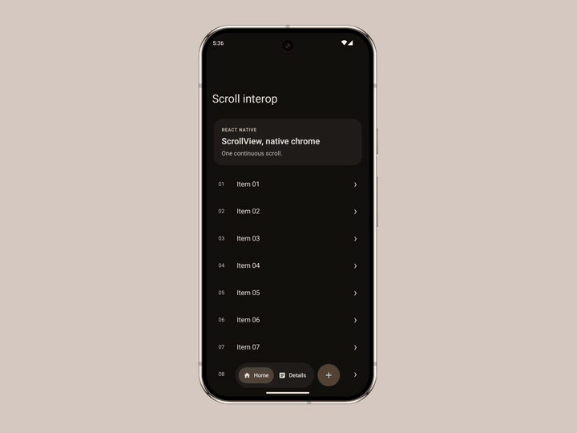

# react-native-scroll-interop

Native Android nested-scroll participation for React Native.

[](https://github.com/AmatoGiulio/react-native-scroll-interop/actions/workflows/check.yml)

React Native scroll sources already own touch handling, source position, fling physics, and velocity
integration. Native Android UI that reacts to the same gesture should participate in that existing
transaction, not infer a second one from JavaScript events.

> Preserve the physics. Preserve the motion.
>
> Don't synchronize scrolling. Participate in it.

`react-native-scroll-interop` lets native Android participants join the real synchronous
nested-scroll transaction produced by a supported React Native scroll source. React Native remains
the single owner of source motion.

```text
React Native scroll source
          │
          ▼
real Android nested-scroll transaction
          │
          ▼
 PRE → React Native child → POST
          │
          ▼
 N native participants
```

```text
one React Native scroll physics
one synchronous Android nested-scroll transaction
N native participants
```

Material3 TopAppBar and FloatingToolbar are shipped reference participants used to make the
primitive observable. They are not the purpose of the package and are not part of the neutral
transport contract.

## Reference demo

<p align="center">
  <a href="https://github.com/AmatoGiulio/react-native-scroll-interop/releases/download/v0.1.0-alpha.1/react-native-scroll-interop-alpha-demo.mp4">
    
  </a>
</p>

The clip makes native participation observable through the shipped TopAppBar and FloatingToolbar
reference consumers. React Native still owns the gesture, source position, and fling physics.
Select the preview for the higher-quality MP4.

## Status

```text
react-native-scroll-interop@0.1.0-alpha.1
npm dist-tag: next
```

This alpha has a deliberately narrow compatibility matrix. Recorded evidence and the current
publication gates are tracked separately in [`docs/release.md`](./docs/release.md).

## Negative guarantees

The transport has:

- no second source `Scroller` / `OverScroller`;
- no parent `scrollBy` / `scrollTo` on the React Native source;
- no sampled `scrollY` transport;
- no timer-based momentum reconstruction;
- no duplicated velocity integration;
- no per-frame JavaScript transport.

These are architecture invariants guarded by the repository checks, not performance slogans.

## Architecture

The library tracks source identity and lifecycle, conserves signed PRE/POST distance, and exposes
the same Android transaction to native participants:

```text
requested = preConsumed + childConsumed + postConsumed + remaining
```

Full contract: [`docs/architecture.md`](./docs/architecture.md).

## Installation

```bash
npm install react-native-scroll-interop@next
```

The package autolinks as a standard React Native Android package. Expo Modules are not required by the native runtime.

## Compatibility

| Target | Current status |
|---|---|
| Expo SDK 57 + React Native 0.86.0 | **Recorded PR #26 baseline**: exact tarball install, clean prebuild, Android compile/assemble, install/runtime, navigation ownership, touch/fling/reverse-fling |
| bare React Native 0.87.0-rc.3 | **Recorded PR #26 baseline**: exact tarball install, standard autolinking, compatibility adapter, Android compile/assemble/install, Hermes runtime, touch/fling/reverse-fling |
| React Native 0.87.x | Accepted by the peer range; the repository example builds, but stable 0.87 runtime certification is not yet recorded |
| react-native-screens 4.26.x | Version-scoped navigation ownership adapter validated on the recorded baseline |
| Android | Neutral nested-scroll core + generic RN boundary + shipped Material3 reference participants |
| iOS / web | `NativeScrollHost` preserves normal View layout, Material reference chrome renders no UI, and navigation options pass through; Android nested-scroll semantics are not emulated |

Peer contracts:

```text
react-native                       >=0.86.0 <0.87.0 || >=0.87.0-rc.3 <0.88.0
react                              >=19.2.0 <20.0.0
react-native-safe-area-context     >=5.0.0 <6.0.0
react-native-screens               >=4.26.0 <4.27.0    optional
expo-router                        >=57.0.0 <58.0.0     optional
@react-navigation/native-stack     >=7.0.0 <8.0.0       optional
```

The recorded baseline is evidence for those exact consumer shapes, not a blanket certification of
every version admitted by the peer ranges. See [`docs/release.md`](./docs/release.md).

## Verified source boundary

The current Android boundary recognizes React Native's `ReactScrollView` and generated
`ReactNestedScrollView`. Recorded runtime validation uses ScrollView-based Expo and bare examples.

This alpha does **not** claim verified support for FlatList, FlashList, LegendList, or arbitrary
virtualized-list implementations. The architecture can admit additional React Native sources
through compatible native source boundaries, but each boundary still requires explicit validation.

## Examples

Repository-only consumer apps live under [`examples/`](./examples/):

- [`examples/expo`](./examples/expo/) — Expo SDK 57 / React Native 0.86 app using the config plugin and Expo Router integration.
- [`examples/bare`](./examples/bare/) — bare React Native 0.87 app using standard autolinking, the bare compatibility adapter, `NativeScrollHost`, and `MaterialTopAppBar`.

The Expo app is the visual reference demo: Material3 TopAppBar and FloatingToolbar make native
participation visible, but they do not define the purpose of the package. The stable RN 0.87 example
keeps the integration path reproducible; the formal release certification above remains the
recorded `0.87.0-rc.3` gate until the stable line is rerun and documented. Neither example nor any
demo media is shipped in the npm tarball.

## Root API

The root export contains the ownership host plus the currently shipped Material3 reference
participants. It is not intended as a general Material3 component surface.

```tsx
import {
  MaterialToolbar,
  MaterialTopAppBar,
  NativeScrollHost,
} from 'react-native-scroll-interop';
```

### NativeScrollHost

Use `NativeScrollHost` when the source is not already owned by a supported native screen/container integration.

```tsx
import { ScrollView } from 'react-native';
import { NativeScrollHost } from 'react-native-scroll-interop';

<NativeScrollHost style={{ flex: 1 }}>
  <ScrollView>{/* content */}</ScrollView>
</NativeScrollHost>
```

It discovers a supported RN vertical source and delegates real Android parent callbacks to the generic RN controller. It does not own source motion.

### MaterialTopAppBar

```tsx
<MaterialTopAppBar
  title="Home"
  variant="large"
  scrollBehavior="exitUntilCollapsed"
/>
```

Key props:

```ts
title: string
visible?: boolean
variant?: 'small' | 'medium' | 'large'
scrollBehavior?: 'none' | 'pinned' | 'enterAlways' | 'exitUntilCollapsed'
navigationIcon?: 'none' | 'back'
navigationAccessibilityLabel?: string
onNavigationPress?: () => void
placement?: 'overlay' | 'header'
themeMode?: 'system' | 'light' | 'dark'
dynamicColor?: boolean
```

The TopAppBar is a native Material3 PRE/POST consumer. It never moves the RN source directly.
`pinned`, `enterAlways`, and `exitUntilCollapsed` map one-to-one to the Material3 scroll behaviors.
`none` keeps the bar fixed without attaching Material scroll state; unlike `pinned`, it does not
track content overlap. Navigation defaults to `pinned` for small bars and
`exitUntilCollapsed` for every expandable variant.

### MaterialToolbar

```text
MaterialToolbar.Root
MaterialToolbar.Content
MaterialToolbar.LeadingContent
MaterialToolbar.TrailingContent
MaterialToolbar.IconButton
MaterialToolbar.TextButton
MaterialToolbar.Icon
MaterialToolbar.Text
MaterialToolbar.Fab
```

`scrollBehavior="exitAlways"` observes child-consumed POST distance. FloatingToolbar consumes zero source motion.

## Bare React Native

```bash
node ./node_modules/react-native-scroll-interop/plugin/bareReactNativeScrollCompat.js
```

The compatibility adapter is version-scoped to the validated RN 0.86/0.87 source shapes and fails closed on unsupported shapes. The bare example runs this automatically from its `postinstall` script.

## Expo config plugin

```json
{
  "expo": {
    "plugins": [
      [
        "react-native-scroll-interop",
        {
          "android": {
            "reactNativeScrollCompat": true,
            "reactNativeScreensInterop": true
          }
        }
      ]
    ]
  }
}
```

`reactNativeScrollCompat` applies the same version-scoped RN source compatibility path used by bare RN. `reactNativeScreensInterop` enables the validated screens 4.26.x navigation-first ownership path.

## react-native-screens

The current adapter keeps the native screen/container as the real nested-scroll ancestor and delegates through `ReactNativeScreenNestedScrollBridge`. The screen-side integration contains no Material3, Expo Router, or React Navigation behavior.

Upstream-neutral design and migration plan: [`docs/react-native-screens.md`](./docs/react-native-screens.md).

## Independent upstream work

Two open upstream changes move responsibilities to the layers that already own them:

1. [React Native #57972](https://github.com/react/react-native/pull/57972) preserves the AndroidX
   `TYPE_NON_TOUCH` nested-scroll lifecycle for ordinary `ReactNestedScrollView` flings while React
   Native continues to initiate and own the fling.
2. [react-native-screens #4537](https://github.com/software-mansion/react-native-screens/pull/4537)
   exposes a neutral Android nested-scroll delegate seam while screens retains ownership and first
   priority.

They solve different upstream responsibilities. Neither is a blocker for `0.1.0-alpha.1`; the alpha
uses narrow, fail-closed compatibility adapters for its currently validated versions.

## Expo Router

```tsx
import { Stack } from 'react-native-scroll-interop/router';

<Stack>
  <Stack.Screen
    name="index"
    options={{
      title: 'Home',
      headerLargeTitle: true,
      material3: {
        topAppBar: { scrollBehavior: 'exitUntilCollapsed' },
      },
    }}
  />
</Stack>
```

The adapter wraps Expo Router's existing Stack. It does not create navigation state or transport scroll frames.

## React Navigation

```tsx
import {
  material3NativeStackNavigatorOptions,
  material3NativeStackScreenOptions,
  withMaterial3NativeStackOptions,
} from 'react-native-scroll-interop/react-navigation';
```

```tsx
<Stack.Navigator
  screenOptions={material3NativeStackNavigatorOptions({
    headerLargeTitle: true,
    material3: {
      topAppBar: { scrollBehavior: 'exitUntilCollapsed' },
    },
  })}
>
  {/* screens */}
</Stack.Navigator>
```

Expo Router and React Navigation share one internal navigator-neutral mapper and Material3 header renderer. Neither adapter owns nested-scroll transport.

## Validation

```bash
npm run check
npm pack --dry-run
npm publish --dry-run --access public --tag next
```

The check suite guards architecture boundaries, nested-scroll ownership/conservation, Material3 boundaries, navigation mapping, RN compatibility transformations, the current screens adapter, repository example layout, and npm package surface.

Native/runtime changes additionally require fresh consumer builds and device/emulator validation. See [`docs/release.md`](./docs/release.md).

## Project docs

- [Architecture](./docs/architecture.md)
- [Release / certification](./docs/release.md)
- [Roadmap](./docs/roadmap.md)
- [react-native-screens upstream path](./docs/react-native-screens.md)
- [Examples](./examples/)
- [Changelog](./CHANGELOG.md)

## Stability

`0.1.x-alpha` is pre-1.0 and uses the `next` dist-tag. The stable `latest` tag should wait for stable RN certification, reproducible regression coverage, a settled navigation ownership path, and real external usage.

## License

MIT.
