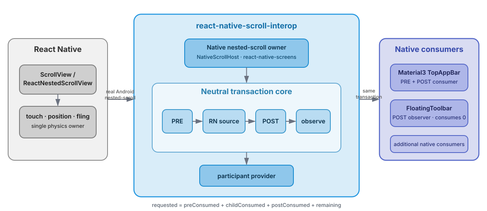

# react-native-scroll-interop

Native Android nested-scroll interoperability for React Native.

[](https://github.com/AmatoGiulio/react-native-scroll-interop/actions/workflows/check.yml)

`react-native-scroll-interop` exposes the real synchronous Android nested-scroll transaction to native consumers while React Native remains the owner of touch handling, source position, and fling physics.

It is not a JavaScript scroll observer and it does not reconstruct native motion from sampled positions. The goal is to preserve the native pipeline that already produces the correct physics and let native UI participate in that same transaction.

```text
one React Native scroll physics
one synchronous Android nested-scroll transaction
N native consumers
```

Material3 is the shipped reference integration above the generic core; it is not part of the transport contract.

## Status

```text
react-native-scroll-interop@0.1.0-alpha.1
npm dist-tag: next
```

This alpha has a deliberately narrow compatibility matrix. Exact release evidence is tracked in [`docs/release.md`](./docs/release.md).

## Why this exists

React Native already owns the gesture and scroll source. Native UI such as a Material3 TopAppBar also has native nested-scroll behavior. High-fidelity interop should connect those systems without introducing a second scroll engine.

This package avoids per-frame JS `onScroll` transport, sampled `scrollY` momentum reconstruction, parent-owned `Scroller` / `OverScroller` physics, parent `scrollBy` / `scrollTo`, duplicate velocity integration, and fake nested-scroll sessions.

For the Material3 reference implementation, terminal settle is delegated back to native Material state rather than approximated in JavaScript.

## Architecture

<p align="center">
  
</p>

React Native remains the single owner of source motion. The library sits in the middle of the real Android transaction: it tracks source identity and lifecycle, conserves signed PRE/POST distance, and exposes the same transaction to native consumers.

Full contract: [`docs/architecture.md`](./docs/architecture.md).

## Installation

```bash
npm install react-native-scroll-interop@next
```

The package autolinks as a standard React Native Android package. Expo Modules are not required by the native runtime.

## Compatibility

| Target | Current status |
|---|---|
| Expo SDK 57 + React Native 0.86.x | **Certified**: exact package install, clean prebuild, Android compile/assemble, install/runtime, navigation ownership, touch/fling/reverse-fling |
| bare React Native 0.87.0-rc.3 | **Certified**: exact package install, standard autolinking, compatibility adapter, Android compile/assemble/install, Hermes runtime, touch/fling/reverse-fling |
| React Native 0.87.x | Accepted by the peer range; stable 0.87 is tracked as a fresh certification gate |
| react-native-screens 4.26.x | Optional navigation-first adapter validated; long-term path is an upstream-neutral AndroidX delegate seam |
| Android | Neutral nested-scroll core + generic RN boundary + Material3 reference consumers |
| iOS / web | Safe fallbacks / option pass-through; Android nested-scroll semantics are not emulated |

Peer contracts:

```text
react-native                       >=0.86.0 <0.87.0 || >=0.87.0-rc.3 <0.88.0
react                              >=19.2.0 <20.0.0
react-native-safe-area-context     >=5.0.0 <6.0.0
react-native-screens               >=4.26.0 <4.27.0    optional
expo-router                        >=57.0.0 <58.0.0     optional
@react-navigation/native-stack     >=7.0.0 <8.0.0       optional
```

## Root API

```tsx
import {
  MaterialToolbar,
  MaterialTopAppBar,
  NativeScrollHost,
} from 'react-native-scroll-interop';
```

### NativeScrollHost

Use `NativeScrollHost` when the source is not already owned by a supported native screen/container integration.

```tsx
import { ScrollView } from 'react-native';
import { NativeScrollHost } from 'react-native-scroll-interop';

<NativeScrollHost style={{ flex: 1 }}>
  <ScrollView>{/* content */}</ScrollView>
</NativeScrollHost>
```

It discovers a supported RN vertical source and delegates real Android parent callbacks to the generic RN controller. It does not own source motion.

### MaterialTopAppBar

```tsx
<MaterialTopAppBar
  title="Home"
  variant="large"
  scrollBehavior="exitUntilCollapsed"
/>
```

Key props:

```ts
title: string
visible?: boolean
variant?: 'small' | 'medium' | 'large'
scrollBehavior?: 'none' | 'enterAlways' | 'exitUntilCollapsed'
navigationIcon?: 'none' | 'back'
navigationAccessibilityLabel?: string
onNavigationPress?: () => void
placement?: 'overlay' | 'header'
themeMode?: 'system' | 'light' | 'dark'
dynamicColor?: boolean
```

The TopAppBar is a native Material3 PRE/POST consumer. It never moves the RN source directly.

### MaterialToolbar

```text
MaterialToolbar.Root
MaterialToolbar.Content
MaterialToolbar.LeadingContent
MaterialToolbar.TrailingContent
MaterialToolbar.IconButton
MaterialToolbar.TextButton
MaterialToolbar.Icon
MaterialToolbar.Text
MaterialToolbar.Fab
```

`scrollBehavior="exitAlways"` observes child-consumed POST distance. FloatingToolbar consumes zero source motion.

## Bare React Native

```bash
node ./node_modules/react-native-scroll-interop/plugin/bareReactNativeScrollCompat.js
```

The compatibility adapter is version-scoped to the validated RN 0.86/0.87 source shapes and fails closed on unsupported shapes.

## Expo config plugin

```json
{
  "expo": {
    "plugins": [
      [
        "react-native-scroll-interop",
        {
          "android": {
            "reactNativeScrollCompat": true,
            "reactNativeScreensInterop": true
          }
        }
      ]
    ]
  }
}
```

`reactNativeScrollCompat` applies the same version-scoped RN source compatibility path used by bare RN. `reactNativeScreensInterop` enables the validated screens 4.26.x navigation-first ownership path.

## react-native-screens

The current adapter keeps the native screen/container as the real nested-scroll ancestor and delegates through `ReactNativeScreenNestedScrollBridge`. The screen-side integration contains no Material3, Expo Router, or React Navigation behavior.

Upstream-neutral design and migration plan: [`docs/react-native-screens.md`](./docs/react-native-screens.md).

## Expo Router

```tsx
import { Stack } from 'react-native-scroll-interop/router';

<Stack>
  <Stack.Screen
    name="index"
    options={{
      title: 'Home',
      headerLargeTitle: true,
      material3: {
        topAppBar: { scrollBehavior: 'exitUntilCollapsed' },
      },
    }}
  />
</Stack>
```

The adapter wraps Expo Router's existing Stack. It does not create navigation state or transport scroll frames.

## React Navigation

```tsx
import {
  material3NativeStackNavigatorOptions,
  material3NativeStackScreenOptions,
  withMaterial3NativeStackOptions,
} from 'react-native-scroll-interop/react-navigation';
```

```tsx
<Stack.Navigator
  screenOptions={material3NativeStackNavigatorOptions({
    headerLargeTitle: true,
    material3: {
      topAppBar: { scrollBehavior: 'exitUntilCollapsed' },
    },
  })}
>
  {/* screens */}
</Stack.Navigator>
```

Expo Router and React Navigation share one internal navigator-neutral mapper and Material3 header renderer. Neither adapter owns nested-scroll transport.

## Validation

```bash
npm run check
npm pack --dry-run
```

The check suite guards architecture boundaries, nested-scroll ownership/conservation, Material3 boundaries, navigation mapping, RN compatibility transformations, the current screens adapter, and npm package surface.

Native/runtime changes additionally require fresh consumer builds and device/emulator validation. See [`docs/release.md`](./docs/release.md).

## Project docs

- [Architecture](./docs/architecture.md)
- [Release / certification](./docs/release.md)
- [Roadmap](./docs/roadmap.md)
- [react-native-screens upstream path](./docs/react-native-screens.md)
- [Changelog](./CHANGELOG.md)

## Stability

`0.1.x-alpha` is pre-1.0 and published under `next`. The stable `latest` tag should wait for stable RN certification, reproducible regression coverage, a settled navigation ownership path, and real external usage.

## License

MIT.
